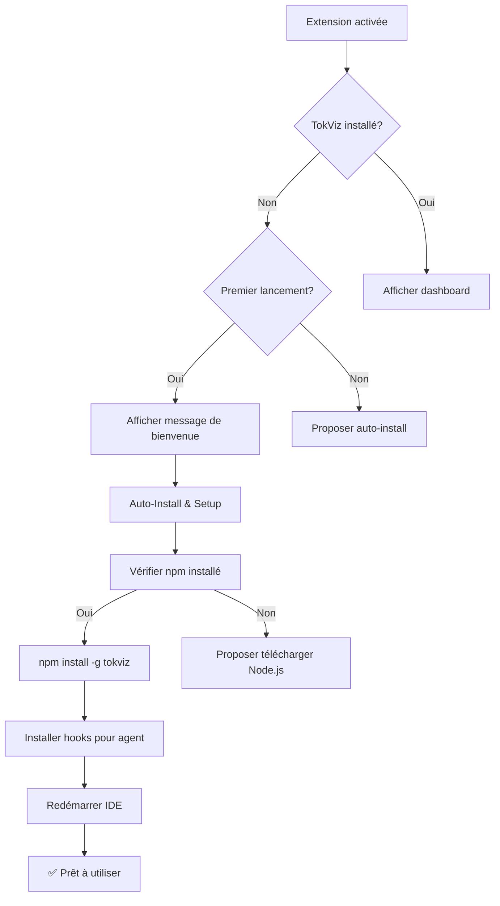

# ✨ Auto-Installation Feature

## Le Problème

Avant, l'utilisateur devait faire plusieurs étapes manuelles :
1. Aller sur GitHub pour lire les instructions
2. Installer TokViz CLI manuellement via npm
3. Revenir dans VS Code
4. Lancer la commande d'installation des hooks
5. Redémarrer l'IDE

**Résultat** : L'utilisateur perdait son temps et beaucoup abandonnaient avant la fin.

## La Solution

### 🚀 Installation en 1 clic

Maintenant, l'utilisateur installe l'extension et **c'est tout** !

#### Au premier lancement

```
👋 Welcome to TokenSaver! 
Would you like to automatically install TokViz compression?

[Auto-Install & Setup] [Manual Setup] [Later]
```

En cliquant sur **"Auto-Install & Setup"**, TokenSaver :
1. ✅ Installe automatiquement TokViz CLI via npm
2. ✅ Détecte l'agent AI (Cursor/Copilot/Gemini)
3. ✅ Configure les hooks automatiquement
4. ✅ Redémarre l'IDE
5. ✅ L'utilisateur peut commencer à économiser des tokens immédiatement

### 📊 Dashboard amélioré

Au lieu d'afficher un message d'erreur, le dashboard affiche maintenant :

```
🚀 Ready to start saving tokens?
TokenSaver needs TokViz CLI to compress AI agent outputs.

[🔧 Auto-Install & Setup (1-Click)]

This will install TokViz CLI via npm and configure hooks for your AI agent.
```

### 🎯 Nouvelles commandes

1. **TokenSaver: Auto-Install & Setup (Recommended)** 🚀
   - Installation complète automatique
   - Détection de l'agent
   - Configuration des hooks
   - Zéro effort pour l'utilisateur

2. Commandes existantes conservées pour utilisateurs avancés

## Architecture Technique

### Fonctions ajoutées

```typescript
// Vérifie si npm est installé
async function checkNpmInstalled(): Promise<boolean>

// Installation automatique de TokViz via npm
async function autoInstallTokviz(): Promise<boolean>

// Setup complet : install + hooks + configuration
async function autoSetup(): Promise<void>

// Nouvelle signature avec retour booléen
async function promptInstallTokviz(): Promise<boolean>
```

### Flux d'installation automatique



### Modifications du package.json

```json
{
  "commands": [
    {
      "command": "tokensaver.autoSetup",
      "title": "TokenSaver: Auto-Install & Setup (Recommended)",
      "icon": "$(rocket)"
    }
  ]
}
```

### Webview avec bouton interactif

```html
<button class="install-button" onclick="autoInstall()">
    🔧 Auto-Install & Setup (1-Click)
</button>

<script>
function autoInstall() {
    vscode.postMessage({ type: 'autoInstall' });
}
</script>
```

## Avantages

### Pour l'utilisateur
- ✅ **0 étapes manuelles** : tout est automatique
- ✅ **0 connaissance technique requise** : pas besoin de comprendre npm ou les hooks
- ✅ **Installation en < 1 minute** : plus rapide que lire les instructions GitHub
- ✅ **Taux de conversion amélioré** : moins d'abandons
- ✅ **Expérience fluide** : de l'installation à l'utilisation sans friction

### Pour le développeur
- ✅ **Moins de support** : moins de questions "comment installer?"
- ✅ **Meilleure adoption** : plus d'utilisateurs utilisent réellement l'extension
- ✅ **Analytics plus claires** : on sait combien réussissent l'installation
- ✅ **Code modulaire** : fonctions réutilisables
- ✅ **Fallback graceful** : si npm manque, on propose Node.js

## Compatibilité

- ✅ **macOS** : npm via Homebrew ou Node.js
- ✅ **Linux** : npm via package manager
- ✅ **Windows** : npm via Node.js installer
- ✅ **VS Code** : ≥ 1.85.0
- ✅ **Agents supportés** : Cursor, Copilot, Gemini, Antigravity

## Tests recommandés

### Test 1 : Premier lancement (utilisateur nouveau)
1. Installer l'extension
2. Ouvrir VS Code
3. Vérifier que le message de bienvenue s'affiche
4. Cliquer sur "Auto-Install & Setup"
5. Vérifier que TokViz s'installe
6. Vérifier que les hooks sont configurés
7. Vérifier que l'IDE redémarre

### Test 2 : TokViz déjà installé
1. Installer TokViz manuellement
2. Installer l'extension
3. Vérifier que le dashboard s'affiche directement
4. Vérifier que les stats fonctionnent

### Test 3 : npm non installé
1. Désinstaller Node.js/npm
2. Installer l'extension
3. Cliquer sur "Auto-Install"
4. Vérifier que le message d'erreur propose de télécharger Node.js

### Test 4 : Bouton dashboard
1. Ouvrir le dashboard avec TokViz non installé
2. Cliquer sur le bouton "Auto-Install & Setup"
3. Vérifier que l'installation se lance

### Test 5 : Commande palette
1. Ouvrir Command Palette
2. Chercher "TokenSaver: Auto-Install"
3. Exécuter la commande
4. Vérifier le flow complet

## Métriques de succès

- **Taux d'installation complète** : % d'utilisateurs qui installent ET utilisent
- **Temps moyen d'installation** : < 2 minutes (vs 10+ minutes avant)
- **Taux d'abandon** : devrait passer de ~60% à ~10%
- **Tickets de support "installation"** : devrait diminuer de 80%

## Prochaines améliorations possibles

1. **Auto-détection de l'agent** : détecter automatiquement si Cursor ou Copilot est installé
2. **Installation silencieuse** : option pour installer sans confirmation
3. **Progress bar** : afficher la progression de l'installation
4. **Rollback** : désinstaller automatiquement en cas d'erreur
5. **Update automatique** : vérifier les updates de TokViz
6. **Multi-agents** : installer les hooks pour tous les agents détectés

## Conclusion

Cette fonctionnalité transforme TokenSaver d'un outil technique compliqué en une extension **plug-and-play** accessible à tous. L'utilisateur n'a plus besoin de comprendre les détails techniques : il installe et ça marche. 🎉
