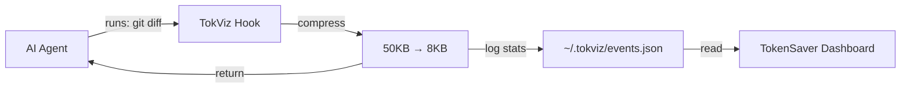

# TokenSaver

<p align="center">
  
</p>

**Save AI tokens automatically.** Visual dashboard for [TokViz](https://github.com/maazizit/tokviz) — compress shell outputs, track savings across Cursor, GitHub Copilot, Gemini CLI, and Antigravity CLI.

Reduce your AI token consumption by **30-70%** with smart compression of terminal outputs (`git diff`, test logs, `grep` results...).

## Why TokenSaver?

AI agents consume massive amounts of tokens from verbose shell outputs. TokenSaver uses **TokViz compression hooks** to reduce this waste:

- ❌ **Before**: `git diff` outputs 50KB → 12,500 tokens sent to AI
- ✅ **After**: Compressed to 8KB → 2,000 tokens (84% saved!)

### Key Features

- 🎯 **One-Click Setup** — Install TokViz hooks for Cursor/Copilot with a single command
- 📊 **Visual Dashboard** — Real-time graphs showing your token savings
- 💰 **Cost Tracking** — See how much you save daily/weekly/monthly
- 🔍 **Detailed Analytics** — Top compressed commands, session comparisons
- ⚡ **Status Bar Widget** — Live savings counter in VS Code
- 🔔 **Smart Notifications** — Alerts when large savings detected

## How it works

## How it works

TokenSaver is the **visual interface** for [TokViz](https://github.com/maazizit/tokviz), a CLI tool that compresses AI agent context via system hooks.



### The TokViz Layer (Behind the Scenes)

TokViz installs **system hooks** that intercept shell commands before they reach your AI agent:

- **Cursor**: `~/.cursor/hooks.json`
- **Copilot**: `~/.copilot/hooks/tokviz-tracker.json`
- **Gemini**: `~/.gemini/hooks.json`

When an agent runs `git diff`, `npm test`, or any shell command, TokViz:
1. Captures the output
2. Compresses it intelligently (removes duplicates, summarizes, keeps important parts)
3. Returns the compressed version to the agent
4. Logs the savings to `~/.tokviz/events.json`

### The TokenSaver Layer (What You See)

TokenSaver extension provides the UI on top:

- **Dashboard**: Visual graphs of your savings over time
- **Installation**: One-click setup of TokViz hooks
- **Monitoring**: Real-time status bar showing daily savings
- **Analytics**: Compare agents, view top compressed commands
- **Verification**: Check that hooks are working correctly

## Quick Start

### 1. Install TokViz CLI (required)

TokenSaver requires TokViz CLI to be installed:

```bash
# Option 1: npm (recommended)
npm install -g @tokviz/cli

# Option 2: from source
git clone https://github.com/maazizit/tokviz
cd tokviz
pnpm install && pnpm build
pnpm link --global
```

### 2. Install TokenSaver Extension

```bash
# From VSIX
code --install-extension tokensaver-0.1.0.vsix

# Or from VS Code Marketplace (coming soon)
```

### 3. Setup Compression Hooks

Open VS Code Command Palette (`Cmd+Shift+P`) and run:

```
TokenSaver: Install TokViz Compression (Cursor)
```

Or for GitHub Copilot:

```
TokenSaver: Install TokViz Compression (Copilot)
```

Or for Antigravity CLI:

```
TokenSaver: Install TokViz Compression (Antigravity)
```

**Restart your IDE** after installation.

### 4. View Your Savings

Click the **TokenSaver** icon in the sidebar, or run:

```
TokenSaver: Show Dashboard
```

## Commands

| Command | Description |
|---------|-------------|
| `TokenSaver: Show Dashboard` | Open visual savings dashboard |
| `TokenSaver: Install TokViz Compression (Cursor)` | Install hooks for Cursor |
| `TokenSaver: Install TokViz Compression (Copilot)` | Install hooks for Copilot |
| `TokenSaver: Install TokViz Compression (Antigravity)` | Install hooks for Antigravity CLI |
| `TokenSaver: Check Installation` | Verify TokViz hooks are working |
| `TokenSaver: View Statistics` | Show detailed stats (CLI output) |
| `TokenSaver: Compare Agents` | Compare token usage across agents |

## Dashboard Features

### 📊 Overview Tab
- Total tokens saved (daily/weekly/monthly)
- Savings percentage
- Top 5 most compressed commands
- Trend graph

### 📈 Analytics Tab
- Command-by-command breakdown
- Session comparison
- Agent comparison (Cursor vs Copilot)
- Export reports

### ⚙️ Settings Tab
- Configure compression level
- Enable/disable notifications
- Enterprise mode (no command logging)
- Auto-install hooks

## Status Bar

The status bar shows live savings:

```
💎 TokenSaver: -45.2K tokens (38%) saved today
```

Click it to open the dashboard.

## Settings

| Setting | Default | Description |
|---------|---------|-------------|
| `tokensaver.tokvizPath` | `tokviz` | Path to TokViz CLI |
| `tokensaver.autoInstallHooks` | `false` | Auto-install hooks on startup |
| `tokensaver.defaultAgent` | `cursor` | Default agent for installation |
| `tokensaver.enterpriseMode` | `false` | Metrics only, no command content |
| `tokensaver.showStatusBar` | `true` | Show savings in status bar |
| `tokensaver.notifyOnSavings` | `true` | Notify on large savings |

## Requirements

- **VS Code** 1.85.0 or higher
- **TokViz CLI** installed globally
- **Cursor**, **GitHub Copilot**, **Gemini CLI**, or **Antigravity CLI** (at least one)

## How Much Can You Save?

Real-world examples from TokViz users:

| Command | Before | After | Saved |
|---------|--------|-------|-------|
| `git diff` | 50KB (12.5K tokens) | 8KB (2K tokens) | **84%** |
| `cargo test` | 120KB (30K tokens) | 15KB (3.8K tokens) | **87%** |
| `npm run build` | 80KB (20K tokens) | 12KB (3K tokens) | **85%** |
| `grep -r pattern` | 200KB (50K tokens) | 25KB (6.3K tokens) | **87%** |

**Average savings: 30-70% of total token consumption**

## Enterprise Mode

For companies concerned about command logging:

```bash
# Install in enterprise mode (metrics only, no command text)
TokenSaver: Install TokViz Compression (Cursor)
→ Check "Enterprise Mode" in settings
```

Data stays local in `~/.tokviz/` on your machine. No cloud sync.

## Troubleshooting

### Hooks not working?

```
TokenSaver: Check Installation
```

This runs `tokviz doctor` and verifies:
- TokViz CLI is installed
- Hooks files exist
- Hooks are executable
- Events are being logged

### Dashboard shows no data?

1. Make sure you're using **Agent mode** (not terminal commands you type manually)
2. Restart VS Code after hook installation
3. Check `~/.tokviz/events.json` exists and has data

### TokViz CLI not found?

Add TokViz to your PATH or configure:

```json
{
  "tokensaver.tokvizPath": "/absolute/path/to/tokviz"
}
```

## Development

```bash
git clone https://github.com/maazizit/tokensaver
cd tokensaver
npm install
npm run compile

# Press F5 in VS Code → Extension Development Host
```

## Related Projects

- **[TokViz](https://github.com/maazizit/tokviz)** — CLI tool for token compression (required backend)
- **[RTK](https://github.com/rtk-ai/rtk)** — Rust Token Killer (inspiration)
- **[Caveman](https://github.com/JuliusBrussee/caveman)** — Prose compression (inspiration)

## Credits

Built by **Zahra Maaziz** · Powered by **[TokViz](https://github.com/maazizit/tokviz)**

Inspired by RTK's shell compression and Caveman's prose optimization.

## License

MIT

---

**Save tokens. Save money. Code smarter with TokenSaver.**

