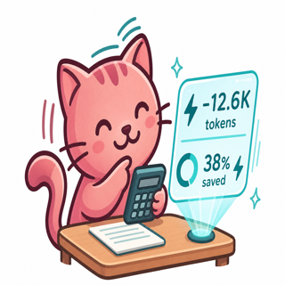
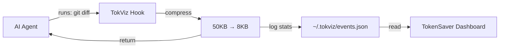

# TokenSaver

<p align="center">
  
</p>

**Compress AI shell output automatically — zero setup.** Install TokenSaver only. TokViz is bundled inside: hooks install silently on startup for Cursor, Copilot, and Gemini/Antigravity. No `npm install`, no manual commands.

Reduce token waste from verbose terminal output (`git diff`, test logs, `grep` results…) by **30–70%**. Dashboard + status bar show how many tokens you **saved** — not how many you spent (that's [TokGuess](https://github.com/maazizit/tokguess)).

## What TokenSaver does (and does not)

| Layer | Tool | Role |
|-------|------|------|
| **Compression** | TokViz (bundled) | Hooks shrink shell output before the agent reads it |
| **Visibility** | TokenSaver | Dashboard + status bar from `~/.tokviz/events.json` |
| **Usage tracking** | [TokGuess](https://github.com/maazizit/tokguess) | Real token counts from Copilot / Claude / Antigravity logs (separate extension) |

TokenSaver does **not** use RTK or Caveman directly. TokViz is an original implementation inspired by their patterns (shell hooks + optional prose skills).

## How it works



### TokViz layer (automatic, invisible)

On extension startup, TokenSaver:

1. Bundles TokViz CLI inside the extension — **no npm, no global install**
2. **Detects** which agents are present on your machine
3. Silently runs `tokviz init -g --agent <name>` for each

| Detected | How | TokViz agent |
|----------|-----|--------------|
| Cursor IDE | App name or `~/.cursor` | `cursor` |
| GitHub Copilot | Extension or `~/.copilot/session-state` | `copilot` |
| Gemini / Antigravity | `~/.gemini` or Antigravity brain paths | `gemini` |
| Claude Code | `~/.claude/projects` | no hooks yet — use TokGuess for usage |

Hooks are written to:

- **Cursor**: `~/.cursor/hooks.json`
- **Copilot**: `~/.copilot/hooks/tokviz-tracker.json`
- **Gemini**: `~/.gemini/hooks.json`

When an agent runs `git diff`, `npm test`, or any shell command in **Agent mode**, TokViz compresses the output and logs savings to `~/.tokviz/events.json`.

### TokenSaver layer (what you see)

- **Sidebar dashboard** — total saved, today, per-agent breakdown
- **Status bar** — `⚡ -12.6K tokens (38%)`
- **Live refresh** — file watcher on `~/.tokviz/events.json`

## Quick Start

### Zero-setup (default)

1. Install the extension (VS Code marketplace or `.vsix`)
2. Reload the window
3. Use your AI agent in **Agent mode**

That's it. No commands, no npm, no TokViz install.

```bash
code --install-extension tokensaver-0.4.0.vsix
```

### Manual re-enable (optional)

If auto-detection missed an agent:

```
TokenSaver: Enable Token Tracking
```

Pick `cursor`, `copilot`, or `gemini`, then reload the window.

## Commands

| Command | Description |
|---------|-------------|
| `TokenSaver: Show Dashboard` | Open savings dashboard |
| `TokenSaver: Refresh` | Reload stats from disk |
| `TokenSaver: Enable Token Tracking` | Manually install hooks for an agent |

## Settings

| Setting | Default | Description |
|---------|---------|-------------|
| `tokensaver.showStatusBar` | `true` | Show savings in the status bar |

## Requirements

- **VS Code** 1.85.0+
- **Cursor**, **GitHub Copilot**, **Gemini CLI**, or **Antigravity CLI** (at least one)
- **Agent mode** — manual terminal commands do not trigger hooks

## How much can you save?

| Command | Before | After | Saved |
|---------|--------|-------|-------|
| `git diff` | 50KB (~12.5K tokens) | 8KB (~2K tokens) | **~84%** |
| `cargo test` | 120KB (~30K tokens) | 15KB (~3.8K tokens) | **~87%** |
| `npm run build` | 80KB (~20K tokens) | 12KB (~3K tokens) | **~85%** |

Numbers are **estimates** (~4 chars/token). Good for relative savings, not exact billing.

## Troubleshooting

### Dashboard shows no data?

1. Use **Agent mode** (not the integrated terminal you type into)
2. Reload VS Code after first install
3. Check `~/.tokviz/events.json` has entries
4. Run `tokviz doctor` if you have the CLI globally, or use **Enable Token Tracking**

### Hooks not installed?

Check `~/.tokviz/cli-path` points to the bundled CLI. Re-run **Enable Token Tracking** and reload.

### Claude detected but no compression?

TokViz hooks are not available for Claude Code yet. Use **TokGuess** for Claude token visibility.

## Development

```bash
git clone https://github.com/maazizit/tokensaver
cd tokensaver
npm install
npm run prepare-cli   # copies CLI from sibling tok-viz repo
npm run compile
# F5 → Extension Development Host
```

## Market research

We studied the landscape before building — [Market Benchmark](docs/MARKET-BENCHMARK.md) covers Eating Token, TokenLens AI, RTK, Caveman, and where TokenSaver + TokGuess fit. *(Yes, there is a spreadsheet. Yes, the cat approved it.)*

## Related projects

- **[TokViz](https://github.com/maazizit/tokviz)** — compression engine (bundled inside TokenSaver)
- **[TokGuess](https://github.com/maazizit/tokguess)** — token usage dashboard for Copilot / Claude / Antigravity
- **[RTK](https://github.com/rtk-ai/rtk)** — inspiration for shell compression pattern
- **[Caveman](https://github.com/JuliusBrussee/caveman)** — inspiration for prose compression pattern

## Credits

Built by **Zahra Maaziz** · Powered by **[TokViz](https://github.com/maazizit/tokviz)**

## License

MIT
